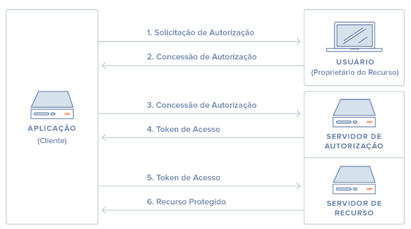

# o que é Oauth?
protocolo de autorização que permite que aplicativos acessem recursos protegidos em nome de um usuário, sem precisar compartilhar diretamente suas credenciais (como login e senha). Ele funciona como uma ponte entre o cliente e o servidor que hospeda os dados ou serviços, autorizando o acesso por meio de tokens seguros.

Antes da versão 2.0, lançada em 2012, o processo de autenticação frequentemente envolvia o envio direto de nome de usuário e senha ao serviço de terceiros, o que representava riscos à segurança. Com o OAuth 2.0, esse modelo foi substituído por um sistema baseado em tokens de acesso, que são emitidos pelo serviço raiz e utilizados pelo cliente para interagir com outros serviços de forma segura e controlada.

ps: importante frisar que o Oauth é um protocolo de autorização é não de autenticação.

# Oauth 2.0
Utiliza token de acesso para representar a autorização para usuários usarem os recursos. ele não tem um formato padrão para o uso desses token, porém, geralmente vesse o uso do JWT.

